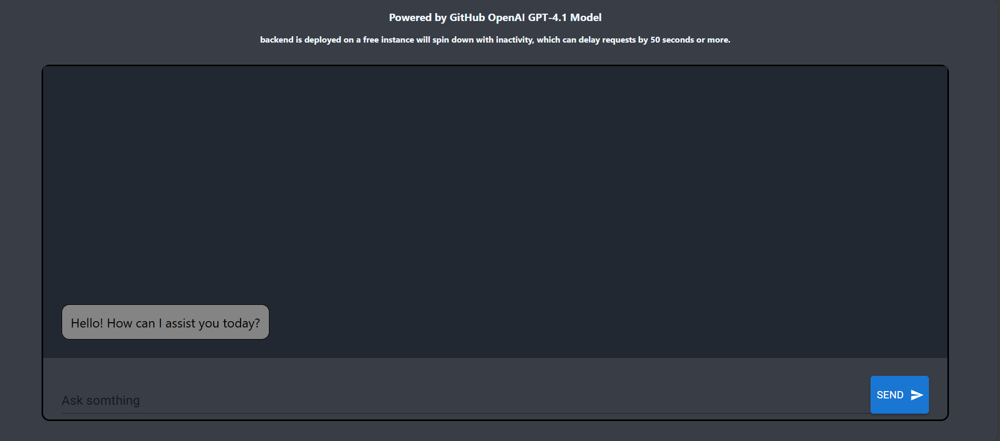

<h1 align="center">AI-Chatbot</h1>

AI-Chatbot is a lightweight, full-stack application that integrates a GPT-4 model hosted on GitHub to facilitate simple, conversational interactions. The frontend is built using the ReactJS framework, providing a responsive and user-friendly interface. On the backend, the application uses Python with the Flask framework, which handles API routing and communication with the GPT-4 model. This setup enables seamless integration between the user interface and the AI model, allowing users to engage in natural language conversations without requiring complex infrastructure.

Its hosted through GitHub Pages which you can check it out [here](https://john310897.github.io/ai-chatbot/)